# Low-Level Architecture - Agent Swamps

## System Architecture Overview

This document provides detailed low-level architecture diagrams and specifications for the Agent Swamps system.

## System Layers Architecture

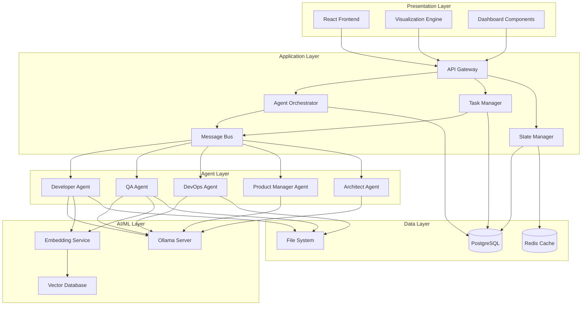

## Component Architecture

### 1. Frontend Architecture

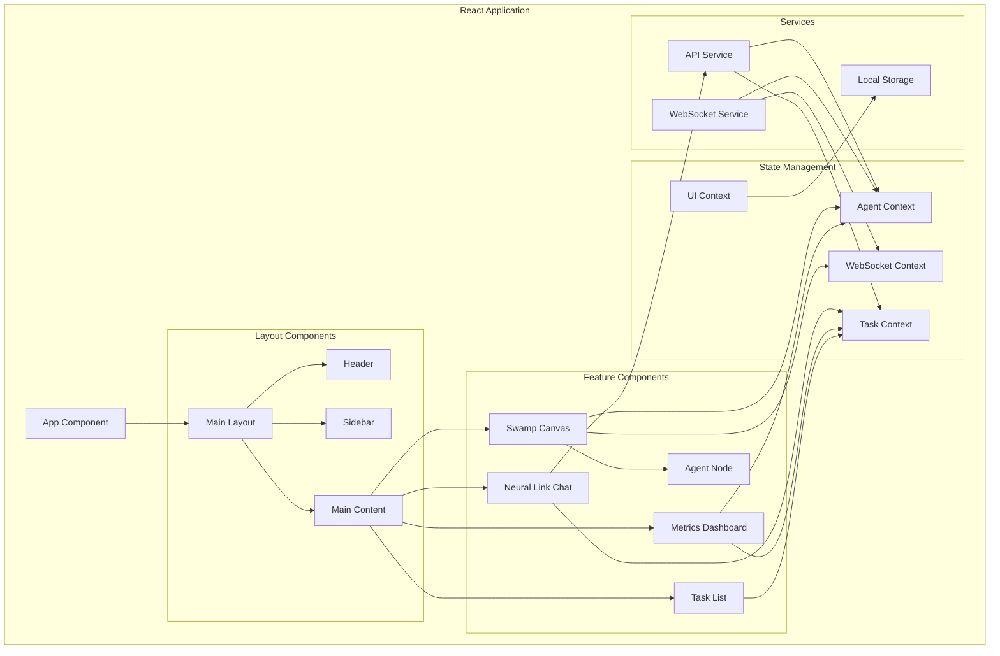

### 2. Backend Service Architecture

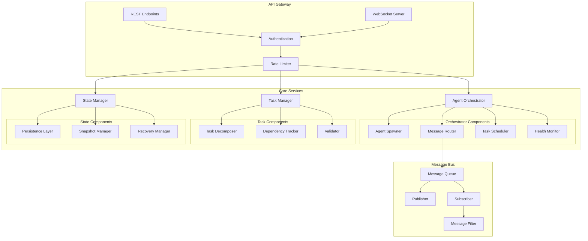

### 3. Agent System Architecture

```mermaid
graph TB
    subgraph "Agent Framework"
        BASE[Base Agent Class]
        
        subgraph "Agent Components"
            BRAIN[Decision Engine]
            MEM[Memory System]
            TOOLS[Tool Interface]
            COMM[Communication Module]
        end
        
        subgraph "Specialized Agents"
            DEV[Developer Agent]
            QA[QA Agent]
            DEVOPS[DevOps Agent]
            PM[PM Agent]
            ARCH[Architect Agent]
        end
    end
    
    subgraph "Agent Capabilities"
        subgraph "Developer Tools"
            CODEGEN[Code Generator]
            REVIEW[Code Reviewer]
            REFACTOR[Refactoring Engine]
            DEBUG[Debugger]
        end
        
        subgraph "QA Tools"
            TESTGEN[Test Generator]
            TESTRUN[Test Runner]
            COVERAGE[Coverage Analyzer]
            BUGTRACK[Bug Tracker]
        end
        
        subgraph "DevOps Tools"
            DEPLOY[Deployer]
            INFRA[Infrastructure Manager]
            CICD[CI/CD Manager]
            MONITOR_TOOL[Monitor Setup]
        end
    end
    
    BASE --> BRAIN
    BASE --> MEM
    BASE --> TOOLS
    BASE --> COMM
    
    DEV -.inherits.-> BASE
    QA -.inherits.-> BASE
    DEVOPS -.inherits.-> BASE
    PM -.inherits.-> BASE
    ARCH -.inherits.-> BASE
    
    DEV --> CODEGEN
    DEV --> REVIEW
    DEV --> REFACTOR
    DEV --> DEBUG
    
    QA --> TESTGEN
    QA --> TESTRUN
    QA --> COVERAGE
    QA --> BUGTRACK
    
    DEVOPS --> DEPLOY
    DEVOPS --> INFRA
    DEVOPS --> CICD
    DEVOPS --> MONITOR_TOOL
```

### 4. Ollama Integration Architecture

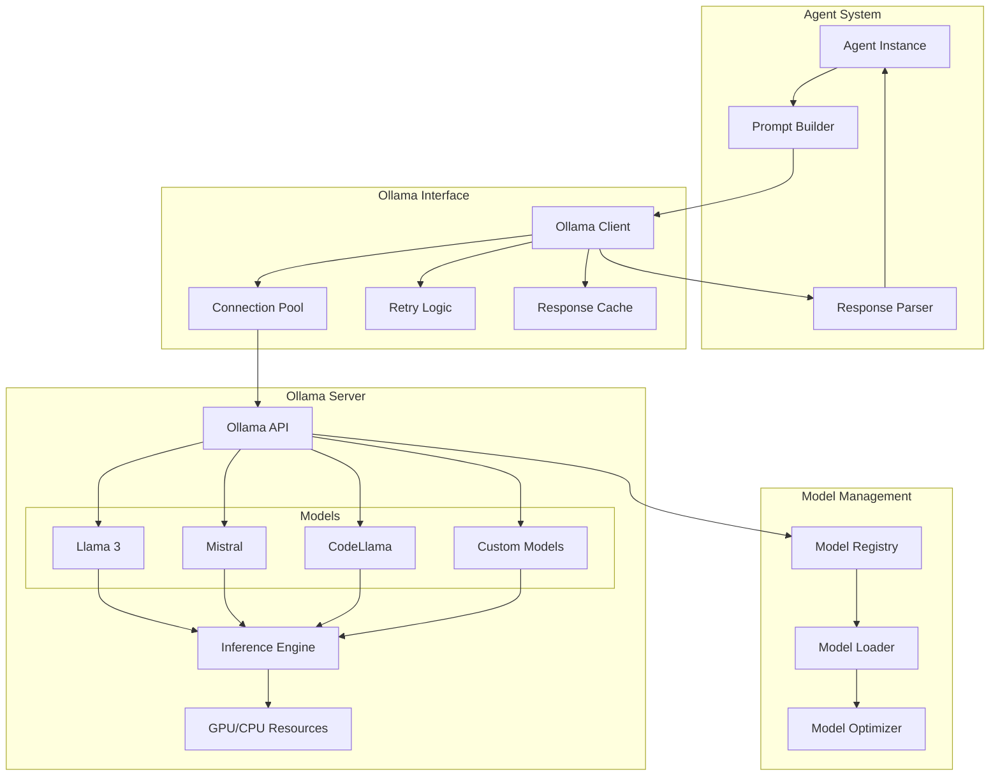

## Data Flow Diagrams

### Task Execution Flow

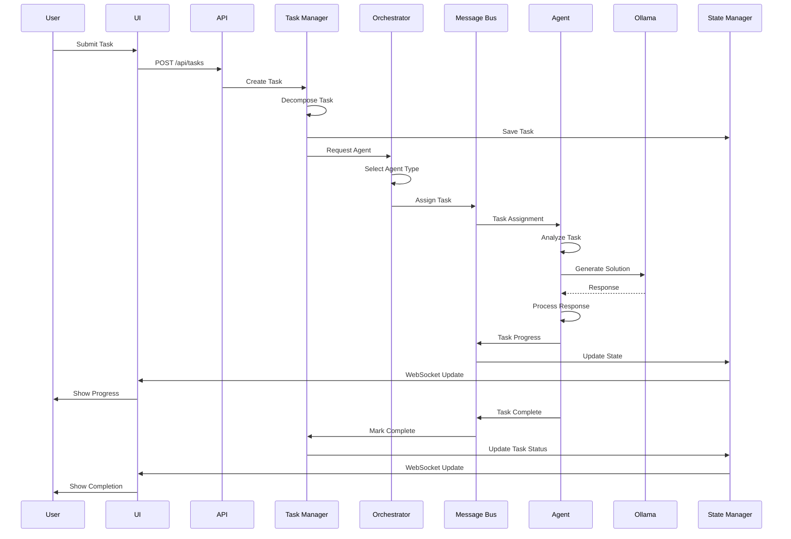

### Agent Communication Flow

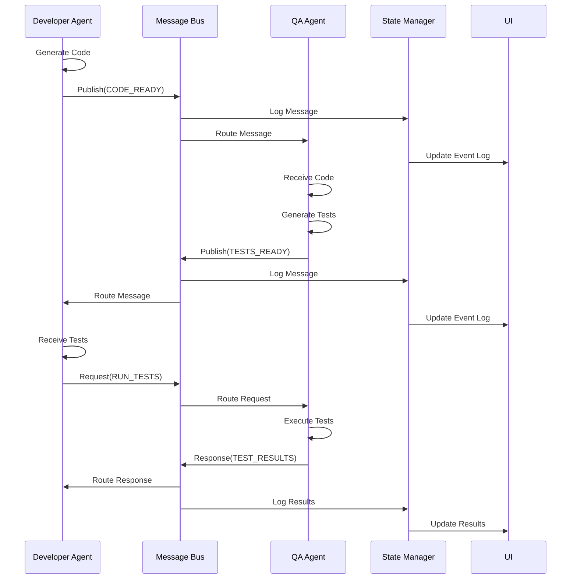

### Real-time Update Flow

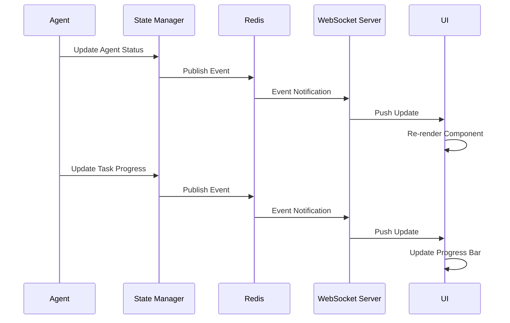

## Database Schema

### Core Tables

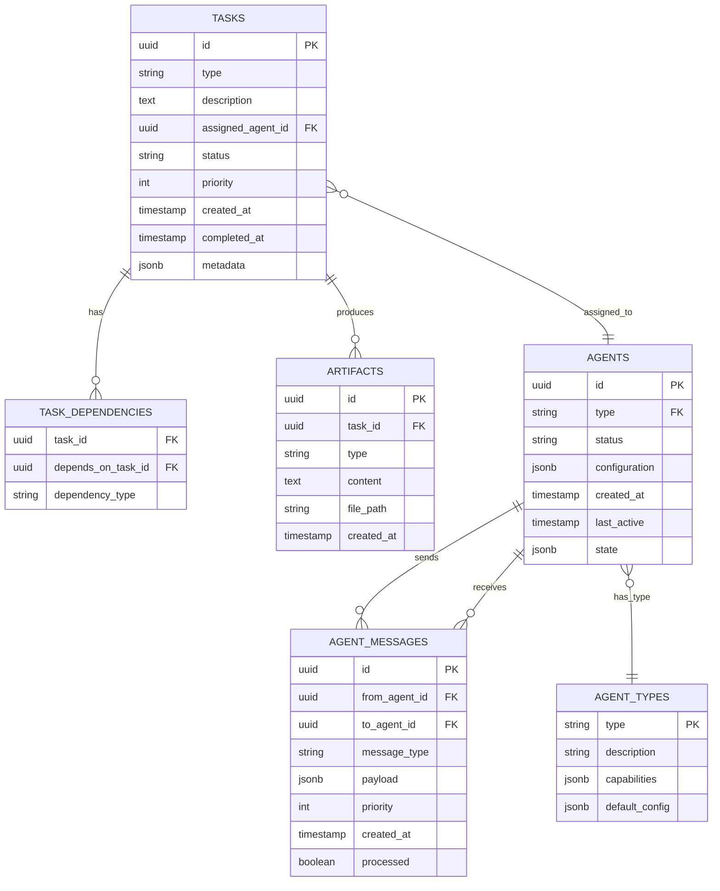

## API Specification

### REST Endpoints

```typescript
// Task Management
POST   /api/tasks                  // Create new task
GET    /api/tasks                  // List all tasks
GET    /api/tasks/:id              // Get task details
PUT    /api/tasks/:id              // Update task
DELETE /api/tasks/:id              // Delete task
GET    /api/tasks/:id/artifacts    // Get task artifacts

// Agent Management
GET    /api/agents                 // List all agents
GET    /api/agents/:id             // Get agent details
POST   /api/agents                 // Create/spawn agent
DELETE /api/agents/:id             // Terminate agent
GET    /api/agents/:id/messages    // Get agent messages
POST   /api/agents/:id/command     // Send command to agent

// System
GET    /api/system/status          // System health
GET    /api/system/metrics         // System metrics
POST   /api/system/config          // Update configuration

// Ollama Integration
GET    /api/ollama/models          // List available models
POST   /api/ollama/generate        // Generate completion
GET    /api/ollama/status          // Ollama server status
```

### WebSocket Events

```typescript
// Client → Server
{
  "type": "subscribe",
  "channels": ["tasks", "agents", "system"]
}

{
  "type": "command",
  "agentId": "uuid",
  "command": "pause" | "resume" | "cancel"
}

// Server → Client
{
  "type": "agent.status",
  "agentId": "uuid",
  "status": "idle" | "thinking" | "coding" | "error",
  "timestamp": 1234567890
}

{
  "type": "task.progress",
  "taskId": "uuid",
  "progress": 75,
  "message": "Generating tests...",
  "timestamp": 1234567890
}

{
  "type": "system.metric",
  "metric": "cpu" | "memory" | "activeAgents",
  "value": 45.2,
  "timestamp": 1234567890
}
```

## Performance Specifications

### Response Time Targets
- API Response: < 100ms (95th percentile)
- WebSocket Latency: < 50ms
- UI Render: < 16ms (60 FPS)
- Ollama Inference: < 2s for small prompts, < 10s for large prompts

### Scalability Targets
- Concurrent Agents: 50-100 per instance
- Concurrent Tasks: 500+ queued tasks
- WebSocket Connections: 1000+ concurrent users
- Message Throughput: 1000+ messages/second

### Resource Requirements
- Frontend: 2 CPU cores, 4GB RAM
- Backend: 4 CPU cores, 8GB RAM
- Ollama: 8 CPU cores, 16GB RAM (32GB recommended with GPU)
- Database: 2 CPU cores, 4GB RAM
- Redis: 1 CPU core, 2GB RAM

## Security Architecture

### Authentication Flow

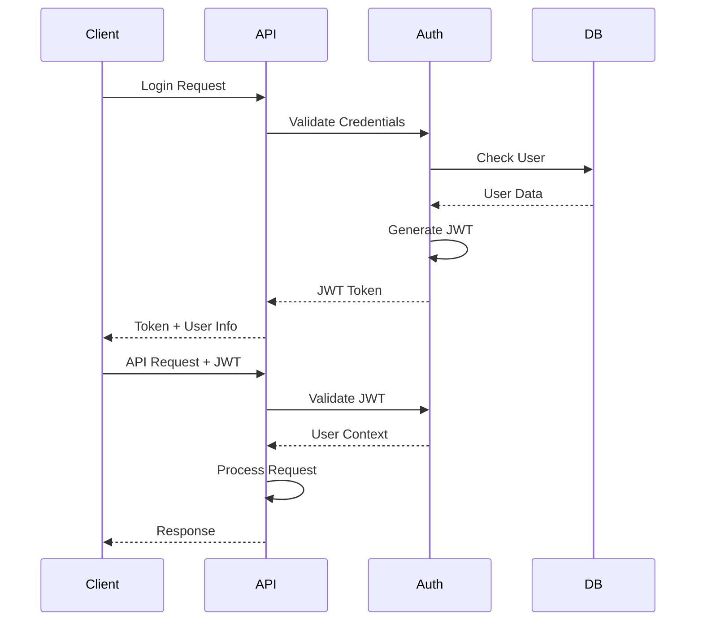

### Security Layers

1. **Network Security**: HTTPS, WSS, CORS policies
2. **Authentication**: JWT-based auth with refresh tokens
3. **Authorization**: Role-based access control (RBAC)
4. **Data Security**: Encryption at rest and in transit
5. **Agent Sandboxing**: Containerized execution environments
6. **Audit Logging**: Complete activity audit trail
7. **Rate Limiting**: API and resource usage limits
8. **Secret Management**: Secure credential storage

## Deployment Architecture

### Development Environment

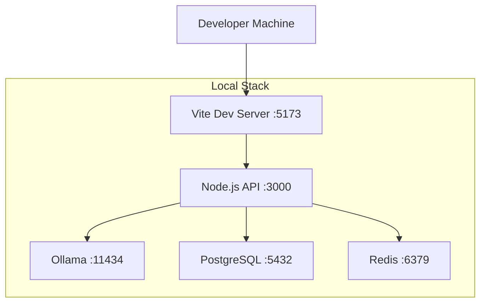

### Production Environment

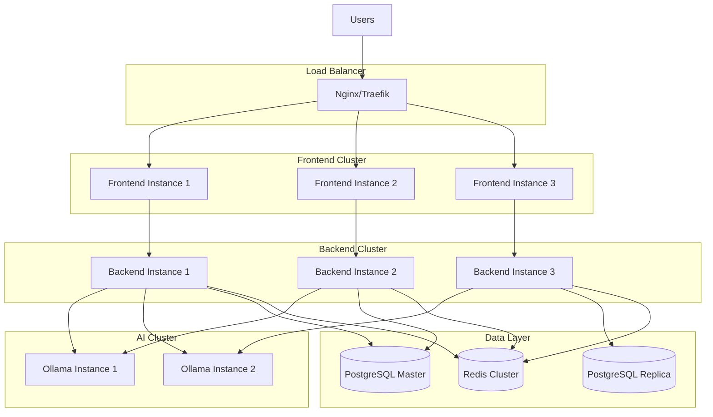

## Monitoring and Observability

### Metrics Collection

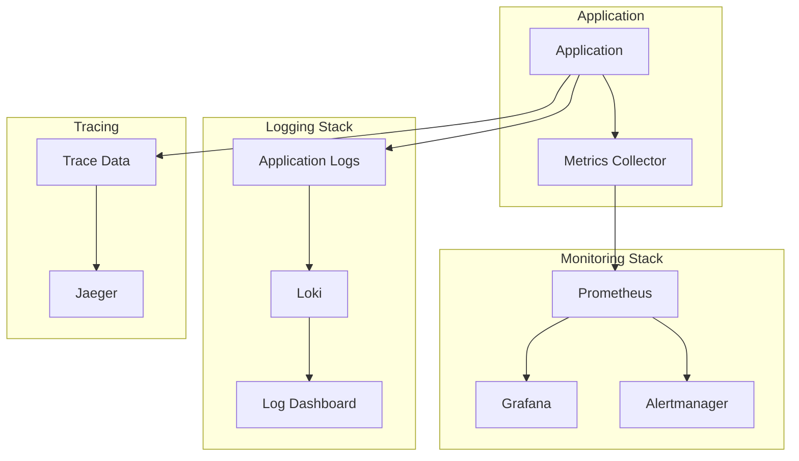

### Key Metrics

- **Agent Metrics**: Active count, success rate, average task time
- **Task Metrics**: Queue depth, completion rate, failure rate
- **System Metrics**: CPU, memory, disk I/O, network
- **Ollama Metrics**: Inference time, token throughput, model load
- **API Metrics**: Request rate, error rate, latency percentiles
