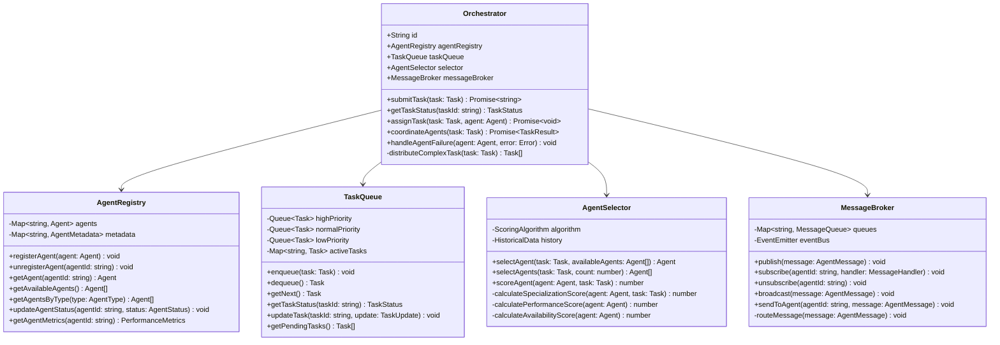
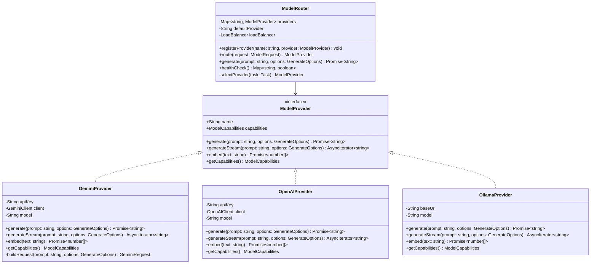
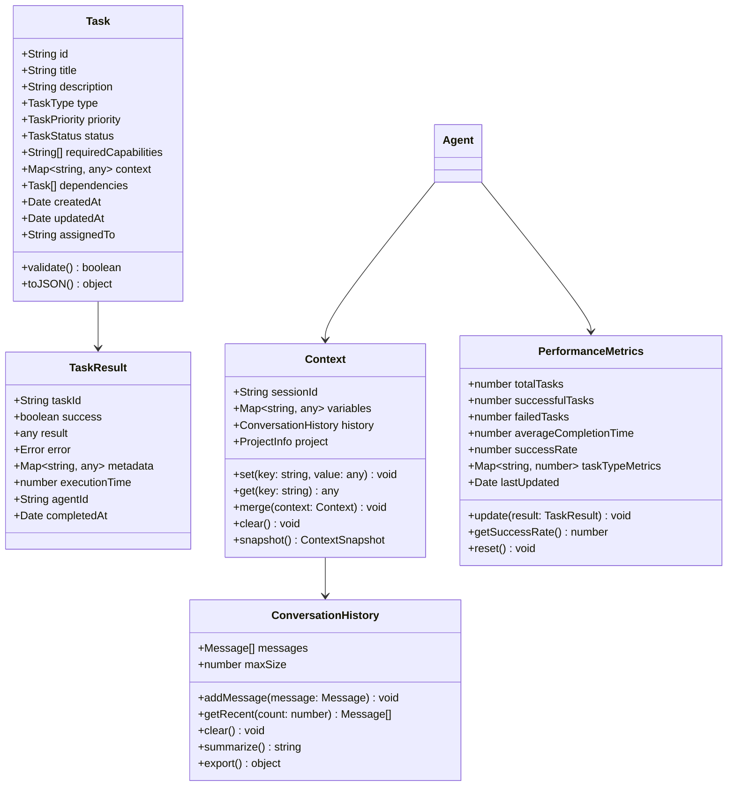
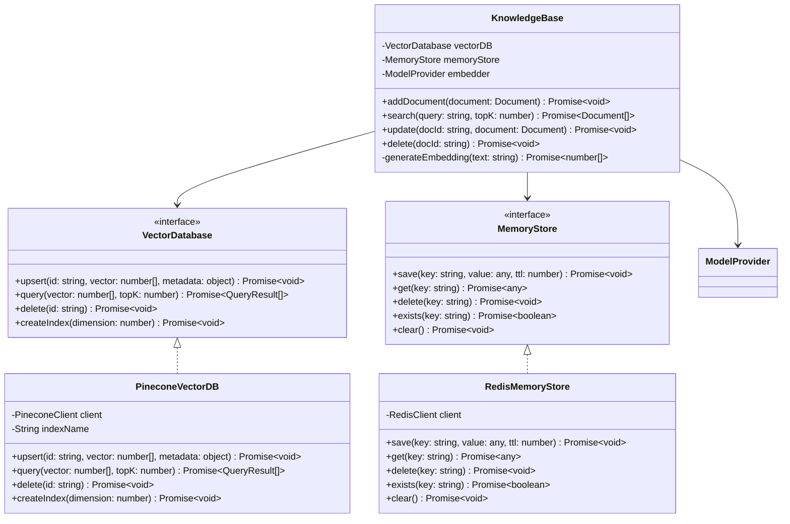
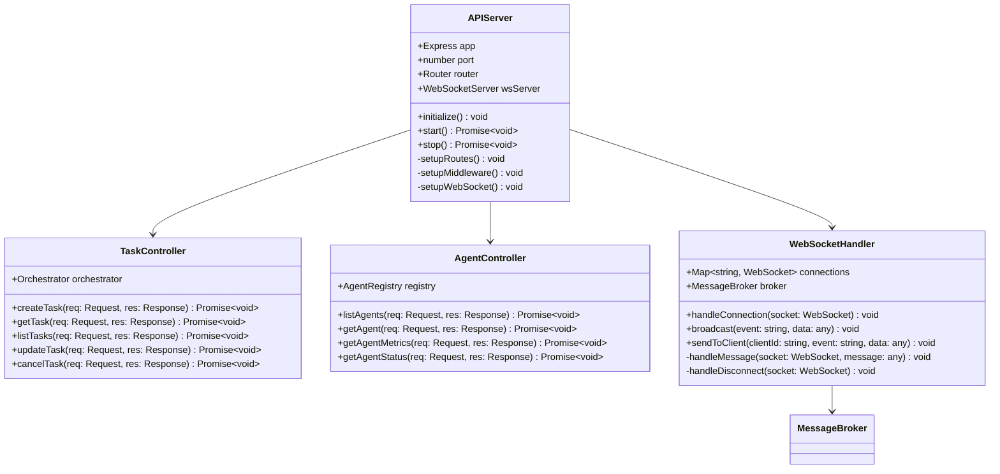

# Class Diagrams - Agent Swamps System

## Core Class Structure

### 1. Agent System Classes

```mermaid
classDiagram
    class Agent {
        <<abstract>>
        +String id
        +String name
        +AgentType type
        +AgentStatus status
        +AgentCapabilities capabilities
        +PerformanceMetrics metrics
        +initialize() void
        +processTask(task: Task) Promise~TaskResult~
        +updateStatus(status: AgentStatus) void
        +getMetrics() PerformanceMetrics
        +canHandle(task: Task) boolean
        #executeWithModel(prompt: string) Promise~string~
        #validate(result: any) boolean
    }

    class DeveloperAgent {
        +String[] programmingLanguages
        +String[] frameworks
        +CodeRepository repository
        +writeCode(specification: string) Promise~Code~
        +reviewCode(code: Code) Promise~Review~
        +refactor(code: Code) Promise~Code~
        +debugIssue(issue: Issue) Promise~Solution~
    }

    class QAAgent {
        +String[] testingFrameworks
        +TestStrategy strategy
        +createTestPlan(requirements: Requirements) Promise~TestPlan~
        +generateTests(code: Code) Promise~TestSuite~
        +executeTests(tests: TestSuite) Promise~TestResults~
        +reportBugs(results: TestResults) Promise~BugReport[]~
    }

    class DevOpsAgent {
        +String[] platforms
        +String[] tools
        +setupCI_CD(project: Project) Promise~Pipeline~
        +deployApplication(app: Application) Promise~Deployment~
        +monitorSystem(system: System) Promise~Metrics~
        +scaleResources(requirements: Requirements) Promise~void~
    }

    class ProductManagerAgent {
        +analyzeRequirements(input: string) Promise~Requirements~
        +prioritizeTasks(tasks: Task[]) Promise~Task[]~
        +createRoadmap(requirements: Requirements) Promise~Roadmap~
        +trackProgress(project: Project) Promise~Report~
    }

    class DesignerAgent {
        +String[] designTools
        +DesignSystem designSystem
        +createMockup(requirements: Requirements) Promise~Design~
        +designUI(specifications: Specifications) Promise~UIDesign~
        +createAssets(needs: AssetNeeds) Promise~Asset[]~
    }

    class ResearchAgent {
        +String[] domains
        +conductResearch(topic: string) Promise~ResearchReport~
        +analyzeTrends(domain: string) Promise~TrendAnalysis~
        +gatherInformation(query: string) Promise~Information~
    }

    Agent <|-- DeveloperAgent
    Agent <|-- QAAgent
    Agent <|-- DevOpsAgent
    Agent <|-- ProductManagerAgent
    Agent <|-- DesignerAgent
    Agent <|-- ResearchAgent
```



### 2. Orchestration System Classes



### 3. Model Integration Classes



### 4. Task and Context Classes



### 5. Data Storage Classes



### 6. API Layer Classes



## Enumeration Types

```typescript
enum AgentType {
    DEVELOPER = 'DEVELOPER',
    QA = 'QA',
    DEVOPS = 'DEVOPS',
    PRODUCT_MANAGER = 'PRODUCT_MANAGER',
    DESIGNER = 'DESIGNER',
    MARKETING = 'MARKETING',
    TECH_WRITER = 'TECH_WRITER',
    RESEARCH = 'RESEARCH'
}

enum AgentStatus {
    INITIALIZED = 'INITIALIZED',
    IDLE = 'IDLE',
    ASSIGNED = 'ASSIGNED',
    THINKING = 'THINKING',
    EXECUTING = 'EXECUTING',
    VALIDATING = 'VALIDATING',
    COMPLETED = 'COMPLETED',
    ERROR = 'ERROR'
}

enum TaskType {
    CODE_GENERATION = 'CODE_GENERATION',
    CODE_REVIEW = 'CODE_REVIEW',
    TESTING = 'TESTING',
    DEPLOYMENT = 'DEPLOYMENT',
    REQUIREMENTS_ANALYSIS = 'REQUIREMENTS_ANALYSIS',
    DESIGN = 'DESIGN',
    DOCUMENTATION = 'DOCUMENTATION',
    RESEARCH = 'RESEARCH'
}

enum TaskPriority {
    LOW = 'LOW',
    MEDIUM = 'MEDIUM',
    HIGH = 'HIGH',
    CRITICAL = 'CRITICAL'
}

enum TaskStatus {
    PENDING = 'PENDING',
    ASSIGNED = 'ASSIGNED',
    IN_PROGRESS = 'IN_PROGRESS',
    COMPLETED = 'COMPLETED',
    FAILED = 'FAILED',
    CANCELLED = 'CANCELLED'
}
```

## Key Design Patterns Used

1. **Abstract Factory Pattern**: Agent creation through AgentRegistry
2. **Strategy Pattern**: Different ModelProviders implementing same interface
3. **Observer Pattern**: MessageBroker for inter-agent communication
4. **Singleton Pattern**: Orchestrator and AgentRegistry instances
5. **Command Pattern**: Task execution and queuing
6. **Decorator Pattern**: Enhancing agents with additional capabilities
7. **Adapter Pattern**: Different model providers adapted to common interface

## Class Relationships Summary

- **Inheritance**: Specialized agents inherit from base Agent class
- **Composition**: Orchestrator composed of Registry, Queue, Selector, Broker
- **Aggregation**: Tasks aggregated into TaskQueue
- **Dependency**: Controllers depend on Orchestrator and Registry
- **Association**: Agents associated with Tasks through assignment
