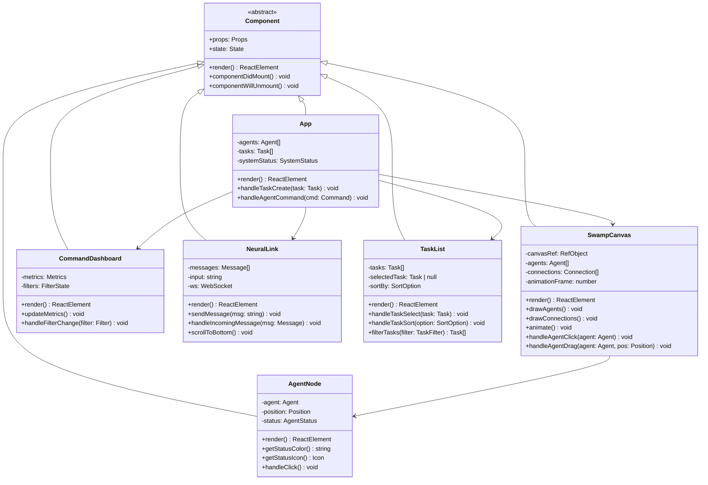
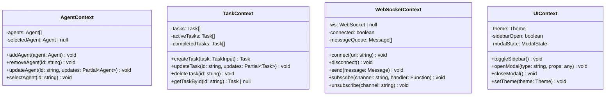
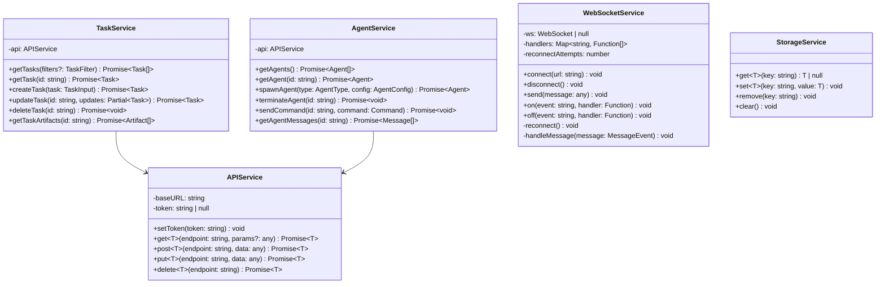
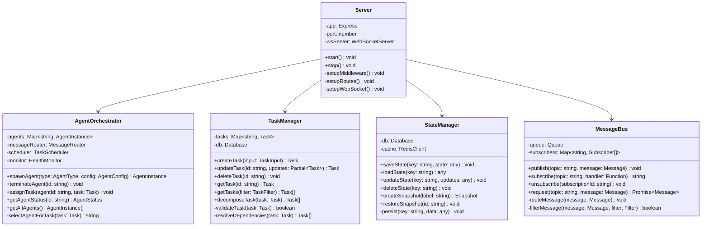
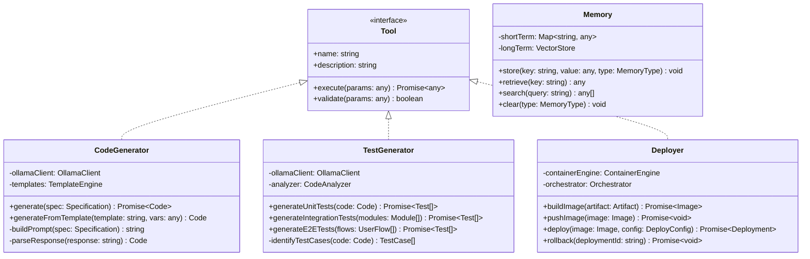
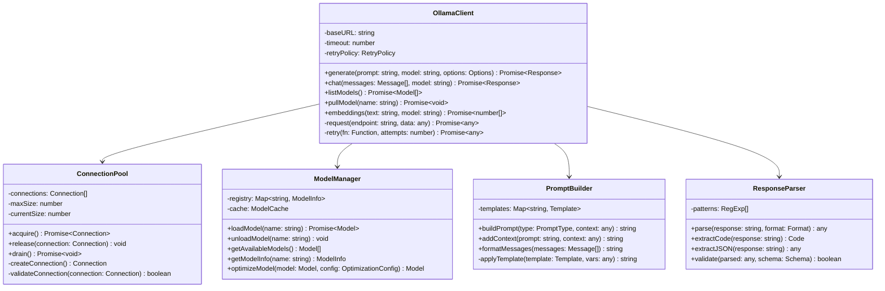
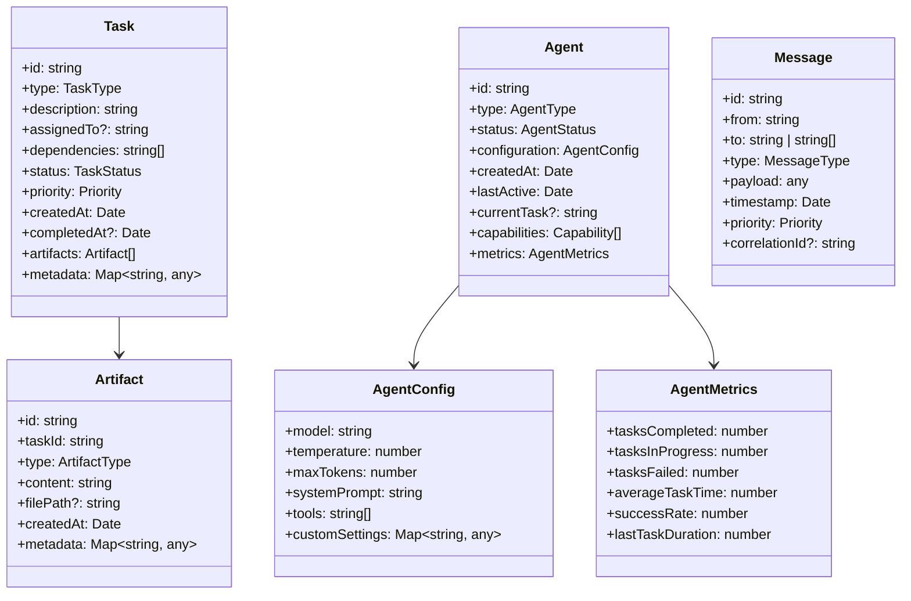
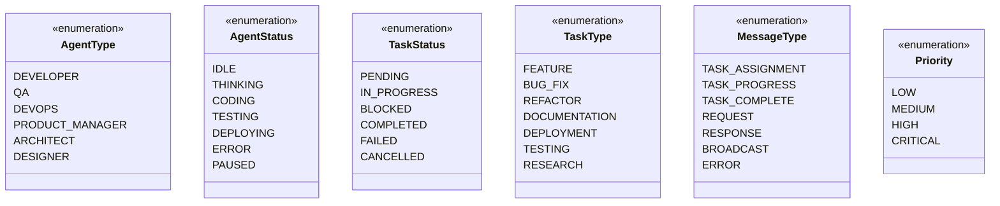
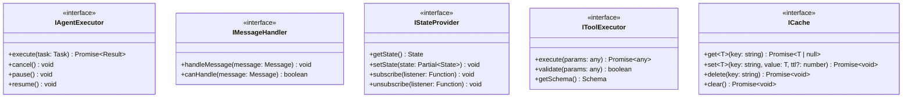

# Class Diagrams - Agent Swamps

This document contains detailed class diagrams for all major components of the Agent Swamps system.

## Frontend Class Structure

### Component Class Hierarchy

### Context Providers

### Service Classes

## Backend Class Structure

### Core Service Classes

### Agent Classes

```mermaid
classDiagram
    class BaseAgent {
        <<abstract>>
        #id: string
        #type: AgentType
        #status: AgentStatus
        #memory: Memory
        #tools: Tool[]
        #messageBus: MessageBus
        +execute(task: Task) Promise~Result~
        +processMessage(message: Message) void
        +updateStatus(status: AgentStatus) void
        #think(context: Context) Promise~Decision~
        #act(decision: Decision) Promise~Result~
        #observe(result: Result) void
    }
    
    class DeveloperAgent {
        -codeGenerator: CodeGenerator
        -codeReviewer: CodeReviewer
        -refactoringEngine: RefactoringEngine
        +execute(task: Task) Promise~Result~
        +generateCode(spec: Specification) Promise~Code~
        +reviewCode(code: Code) Promise~Review~
        +refactorCode(code: Code, rules: Rule[]) Promise~Code~
        -analyzeRequirements(task: Task) Requirements
        -selectTechnologies(requirements: Requirements) TechStack
    }
    
    class QAAgent {
        -testGenerator: TestGenerator
        -testRunner: TestRunner
        -coverageAnalyzer: CoverageAnalyzer
        +execute(task: Task) Promise~Result~
        +generateTests(code: Code) Promise~TestSuite~
        +runTests(tests: TestSuite) Promise~TestResults~
        +analyzeCoverage(results: TestResults) Promise~Coverage~
        -identifyEdgeCases(code: Code) Scenario[]
        -generateTestData() TestData
    }
    
    class DevOpsAgent {
        -deployer: Deployer
        -infraManager: InfrastructureManager
        -cicdManager: CICDManager
        +execute(task: Task) Promise~Result~
        +deploy(artifact: Artifact, env: Environment) Promise~Deployment~
        +setupInfrastructure(spec: InfraSpec) Promise~Infrastructure~
        +configureCICD(config: CICDConfig) Promise~Pipeline~
        -validateDeployment(deployment: Deployment) boolean
    }
    
    class ProductManagerAgent {
        -requirementAnalyzer: RequirementAnalyzer
        -prioritizer: Prioritizer
        +execute(task: Task) Promise~Result~
        +analyzeRequirements(input: UserInput) Requirements
        +prioritizeFeatures(features: Feature[]) Feature[]
        +createRoadmap(features: Feature[]) Roadmap
        -defineAcceptanceCriteria(feature: Feature) Criteria[]
    }
    
    class ArchitectAgent {
        -designGenerator: DesignGenerator
        -patternMatcher: PatternMatcher
        +execute(task: Task) Promise~Result~
        +designSystem(requirements: Requirements) Architecture
        +selectPatterns(context: Context) Pattern[]
        +generateDiagrams(architecture: Architecture) Diagram[]
        -evaluateTradeoffs(options: Option[]) Decision
    }
    
    BaseAgent <|-- DeveloperAgent
    BaseAgent <|-- QAAgent
    BaseAgent <|-- DevOpsAgent
    BaseAgent <|-- ProductManagerAgent
    BaseAgent <|-- ArchitectAgent
```

### Tool and Utility Classes

## Ollama Integration Classes

## Data Model Classes

## Enum and Type Definitions

## Interface Definitions

## Relationship Summary

### Key Relationships

1. **Inheritance**
   - All specialized agents inherit from `BaseAgent`
   - All React components inherit from base `Component`
   - Tool classes implement the `Tool` interface

2. **Composition**
   - `AgentOrchestrator` contains multiple `AgentInstance`s
   - `TaskManager` manages multiple `Task`s
   - `MessageBus` routes messages between agents
   - `StateManager` uses both database and cache

3. **Dependency**
   - Services depend on `APIService` for HTTP communication
   - Agents depend on `OllamaClient` for AI capabilities
   - Components depend on Context providers for state

4. **Association**
   - Tasks are assigned to Agents
   - Messages are sent between Agents
   - Artifacts are produced by Tasks
   - Metrics track Agent performance
