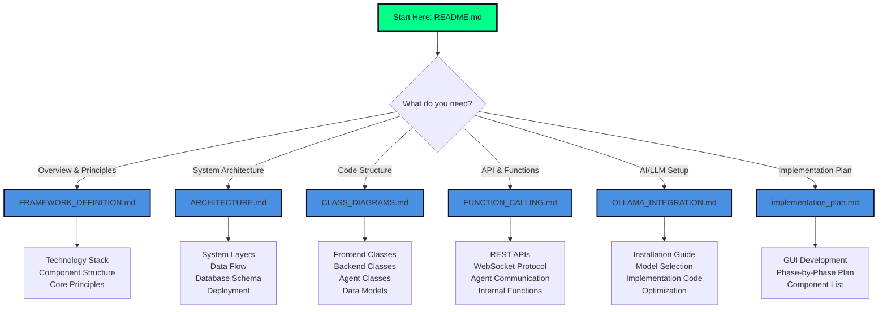

# Documentation Navigation Guide

## 🗺️ How to Navigate This Documentation

This guide helps you find the right documentation for your needs.

## 📋 Quick Reference

### I want to understand...

#### **The big picture**
👉 Start with [README.md](./README.md)
- System overview
- Vision and goals
- Quick start guide

#### **Core concepts and principles**
👉 Read [FRAMEWORK_DEFINITION.md](./FRAMEWORK_DEFINITION.md)
- Framework architecture
- Core principles
- Technology stack
- Component structure
- Security & performance

#### **How the system is structured**
👉 Check [ARCHITECTURE.md](./ARCHITECTURE.md)
- System layers diagram
- Component architecture
- Data flow diagrams
- Database schema
- API specification
- Deployment architecture
- Performance specs

#### **Code organization and classes**
👉 Explore [CLASS_DIAGRAMS.md](./CLASS_DIAGRAMS.md)
- Frontend class hierarchy
- Backend service classes
- Agent classes and inheritance
- Ollama integration classes
- Data models and interfaces

#### **How components communicate**
👉 Review [FUNCTION_CALLING.md](./FUNCTION_CALLING.md)
- Frontend API calls
- Backend REST endpoints
- Inter-agent messaging
- Ollama AI integration
- WebSocket protocol
- Internal function calls

#### **AI/LLM integration**
👉 Study [OLLAMA_INTEGRATION.md](./OLLAMA_INTEGRATION.md)
- What is Ollama
- Installation guide
- Model selection strategy
- Implementation examples
- Configuration
- Performance optimization
- Deployment considerations

#### **GUI implementation roadmap**
👉 See [implementation_plan.md](./implementation_plan.md)
- Phase-by-phase plan
- Component list
- Design aesthetics

## 🎯 Use Case Scenarios

### Scenario 1: "I'm a new developer joining the project"
**Path**: README → FRAMEWORK_DEFINITION → ARCHITECTURE → CLASS_DIAGRAMS

**Why**: This gives you the complete picture from high-level vision down to code structure.

### Scenario 2: "I need to implement a new API endpoint"
**Path**: FUNCTION_CALLING → ARCHITECTURE (API section) → CLASS_DIAGRAMS (Backend classes)

**Why**: Understand the API patterns, then see where it fits in the architecture, then find the relevant classes.

### Scenario 3: "I want to integrate a new AI model"
**Path**: OLLAMA_INTEGRATION → CLASS_DIAGRAMS (Ollama classes) → FUNCTION_CALLING (Ollama section)

**Why**: Learn about Ollama integration, see the class structure, then understand function calls.

### Scenario 4: "I'm designing a new agent type"
**Path**: FRAMEWORK_DEFINITION (Agent Layer) → CLASS_DIAGRAMS (Agent classes) → FUNCTION_CALLING (Inter-agent)

**Why**: Understand the agent framework, see the base classes, learn communication patterns.

### Scenario 5: "I need to deploy the system"
**Path**: ARCHITECTURE (Deployment section) → OLLAMA_INTEGRATION (Deployment) → README (Quick Start)

**Why**: Get deployment architecture, specific Ollama deployment needs, and setup instructions.

### Scenario 6: "I want to build the frontend"
**Path**: implementation_plan → CLASS_DIAGRAMS (Frontend) → FUNCTION_CALLING (Frontend API)

**Why**: See the GUI plan, understand the class structure, learn the API calls.

## 📊 Documentation Matrix

| Document | Purpose | Target Audience | Key Sections |
|----------|---------|----------------|--------------|
| **README.md** | Overview & Navigation | Everyone | Vision, Quick Start, Feature List |
| **FRAMEWORK_DEFINITION.md** | Core Concepts | Architects, Leads | Principles, Stack, Components |
| **ARCHITECTURE.md** | System Design | Architects, DevOps | Layers, Data Flow, Deployment |
| **CLASS_DIAGRAMS.md** | Code Structure | Developers | Class Hierarchies, Relationships |
| **FUNCTION_CALLING.md** | API & Communication | Developers, Integrators | APIs, Protocols, Examples |
| **OLLAMA_INTEGRATION.md** | AI/ML Setup | ML Engineers, DevOps | Setup, Models, Optimization |
| **implementation_plan.md** | GUI Roadmap | Frontend Developers | Phases, Components, Design |

## 🔍 Search Guide

### Looking for specific information?

**Keywords → Document**:

- `architecture`, `layers`, `components` → ARCHITECTURE.md
- `class`, `interface`, `inheritance` → CLASS_DIAGRAMS.md
- `API`, `endpoint`, `function` → FUNCTION_CALLING.md
- `agent`, `workflow`, `principle` → FRAMEWORK_DEFINITION.md
- `Ollama`, `LLM`, `model`, `AI` → OLLAMA_INTEGRATION.md
- `database`, `schema`, `tables` → ARCHITECTURE.md
- `React`, `frontend`, `UI`, `component` → CLASS_DIAGRAMS.md + implementation_plan.md
- `WebSocket`, `message`, `event` → FUNCTION_CALLING.md
- `deployment`, `production`, `scaling` → ARCHITECTURE.md + OLLAMA_INTEGRATION.md
- `security`, `auth`, `permissions` → FRAMEWORK_DEFINITION.md + ARCHITECTURE.md

## 💡 Tips

1. **Start Broad**: Begin with README.md to understand the vision
2. **Go Deep**: Pick the specific document for your task
3. **Cross-Reference**: Documents reference each other - follow the links
4. **Diagrams First**: All documents have visual diagrams - start there
5. **Code Examples**: FUNCTION_CALLING and OLLAMA_INTEGRATION have working code

## 🔄 Documentation Updates

When updating documentation:

1. **Framework changes** → Update FRAMEWORK_DEFINITION.md
2. **Architecture changes** → Update ARCHITECTURE.md + diagrams
3. **New classes** → Update CLASS_DIAGRAMS.md
4. **API changes** → Update FUNCTION_CALLING.md
5. **Ollama changes** → Update OLLAMA_INTEGRATION.md
6. **Major changes** → Update README.md overview

## 📝 Mermaid Diagram Index

All Mermaid diagrams across documents:

**ARCHITECTURE.md**:
- System Layers Architecture
- Frontend Architecture
- Backend Service Architecture
- Agent System Architecture
- Ollama Integration Architecture
- Task Execution Flow (sequence)
- Agent Communication Flow (sequence)
- Real-time Update Flow (sequence)
- Database Schema (ER diagram)
- Security Authentication Flow (sequence)
- Development Environment
- Production Environment
- Metrics Collection

**CLASS_DIAGRAMS.md**:
- Component Class Hierarchy
- Context Providers
- Service Classes
- Core Service Classes
- Agent Classes
- Tool and Utility Classes
- Ollama Integration Classes
- Data Model Classes
- Enum and Type Definitions
- Interface Definitions

**OLLAMA_INTEGRATION.md**:
- System Overview (integration)

**This Document (NAVIGATION.md)**:
- Navigation Flow

---

**Happy navigating! 🚀**
