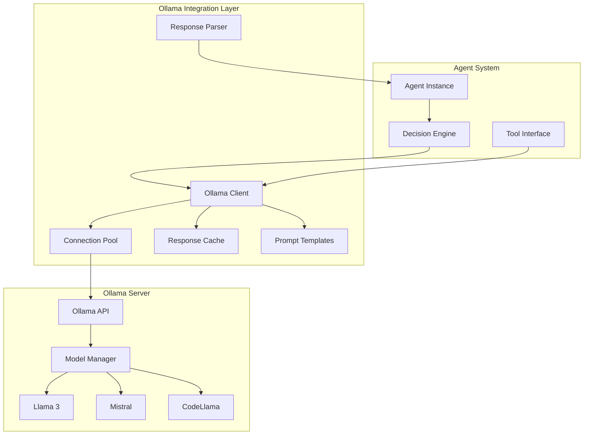

# Ollama Integration Plan - Agent Swamps

## Overview

This document outlines the complete plan for integrating Ollama (local LLM server) into the Agent Swamps system, enabling fully local AI-powered agent capabilities.

## What is Ollama?

Ollama is a lightweight, extensible framework for running large language models locally. It provides:
- Easy model downloading and management
- RESTful API for inference
- Support for multiple models (Llama 3, Mistral, CodeLlama, etc.)
- GPU acceleration support
- Low-latency inference for local development

## Architecture Integration

### System Overview



## Installation and Setup

### 1. Install Ollama

#### On macOS/Linux:
```bash
curl -fsSL https://ollama.com/install.sh | sh
```

#### On Windows:
Download from https://ollama.com/download/windows

### 2. Pull Required Models

```bash
# General purpose model
ollama pull llama3

# Code generation model
ollama pull codellama:13b

# Lightweight model for quick responses
ollama pull mistral

# Embedding model for RAG
ollama pull nomic-embed-text

# Optional: Specialized models
ollama pull deepseek-coder:6.7b
ollama pull phi-2
```

### 3. Verify Installation

```bash
# Check Ollama is running
curl http://localhost:11434/api/tags

# Test generation
ollama run llama3 "Hello, how are you?"
```

## Model Selection Strategy

### By Agent Type

| Agent Type | Primary Model | Fallback Model | Use Case |
|------------|---------------|----------------|----------|
| Developer | codellama:13b | llama3 | Code generation, review |
| QA | llama3 | mistral | Test generation, analysis |
| DevOps | llama3 | mistral | Script generation, config |
| Product Manager | llama3 | mistral | Requirements, planning |
| Architect | llama3 | codellama:13b | System design, patterns |

### By Task Type

| Task Type | Recommended Model | Temperature | Max Tokens |
|-----------|------------------|-------------|------------|
| Code Generation | codellama:13b | 0.3-0.5 | 4096 |
| Code Review | codellama:13b | 0.2 | 2048 |
| Test Generation | codellama:7b | 0.4 | 2048 |
| Documentation | llama3 | 0.6 | 2048 |
| Design/Architecture | llama3 | 0.7 | 3072 |
| Bug Analysis | codellama:13b | 0.3 | 2048 |
| Refactoring | codellama:13b | 0.3 | 4096 |

## Implementation

### 1. Ollama Client Class

```typescript
// src/services/ollama/OllamaClient.ts

import axios, { AxiosInstance } from 'axios';

interface OllamaConfig {
  baseURL: string;
  timeout: number;
  maxRetries: number;
}

interface GenerateOptions {
  model: string;
  prompt: string;
  temperature?: number;
  top_p?: number;
  top_k?: number;
  max_tokens?: number;
  system?: string;
  stream?: boolean;
}

interface GenerateResponse {
  model: string;
  response: string;
  done: boolean;
  context?: number[];
  total_duration: number;
  load_duration: number;
  prompt_eval_count: number;
  eval_count: number;
}

export class OllamaClient {
  private client: AxiosInstance;
  private config: OllamaConfig;
  
  constructor(config: Partial<OllamaConfig> = {}) {
    this.config = {
      baseURL: config.baseURL || 'http://localhost:11434',
      timeout: config.timeout || 120000, // 2 minutes
      maxRetries: config.maxRetries || 3
    };
    
    this.client = axios.create({
      baseURL: this.config.baseURL,
      timeout: this.config.timeout
    });
  }
  
  async generate(options: GenerateOptions): Promise<GenerateResponse> {
    try {
      const response = await this.client.post('/api/generate', {
        model: options.model,
        prompt: options.prompt,
        temperature: options.temperature || 0.7,
        top_p: options.top_p || 0.9,
        top_k: options.top_k || 40,
        num_predict: options.max_tokens || 2048,
        system: options.system,
        stream: false
      });
      
      return response.data;
    } catch (error) {
      throw new Error(`Ollama generation failed: ${error.message}`);
    }
  }
  
  async chat(
    messages: Array<{ role: string; content: string }>,
    model: string = 'llama3',
    options?: Partial<GenerateOptions>
  ): Promise<GenerateResponse> {
    try {
      const response = await this.client.post('/api/chat', {
        model,
        messages,
        temperature: options?.temperature || 0.7,
        stream: false
      });
      
      return response.data;
    } catch (error) {
      throw new Error(`Ollama chat failed: ${error.message}`);
    }
  }
  
  async embeddings(text: string, model: string = 'nomic-embed-text'): Promise<number[]> {
    try {
      const response = await this.client.post('/api/embeddings', {
        model,
        prompt: text
      });
      
      return response.data.embedding;
    } catch (error) {
      throw new Error(`Ollama embeddings failed: ${error.message}`);
    }
  }
  
  async listModels(): Promise<any[]> {
    try {
      const response = await this.client.get('/api/tags');
      return response.data.models;
    } catch (error) {
      throw new Error(`Failed to list models: ${error.message}`);
    }
  }
  
  async pullModel(name: string): Promise<void> {
    try {
      await this.client.post('/api/pull', { name });
    } catch (error) {
      throw new Error(`Failed to pull model: ${error.message}`);
    }
  }
  
  async checkHealth(): Promise<boolean> {
    try {
      await this.client.get('/api/tags');
      return true;
    } catch (error) {
      return false;
    }
  }
}
```

### 2. Prompt Builder

```typescript
// src/services/ollama/PromptBuilder.ts

interface PromptTemplate {
  system: string;
  user: string;
  variables: string[];
}

export class PromptBuilder {
  private templates: Map<string, PromptTemplate>;
  
  constructor() {
    this.templates = new Map();
    this.initializeTemplates();
  }
  
  private initializeTemplates(): void {
    // Code generation template
    this.templates.set('code_generation', {
      system: `You are an expert software developer. Generate clean, well-documented, production-ready code.
Follow best practices and coding standards. Include error handling and type safety.`,
      user: `Generate {{language}} code for the following specification:

{{specification}}

Requirements:
- Use {{framework}} framework
- Follow {{style_guide}} style guide
- Include inline comments for complex logic
- Add TypeScript types/interfaces

Context:
{{context}}`,
      variables: ['language', 'specification', 'framework', 'style_guide', 'context']
    });
    
    // Test generation template
    this.templates.set('test_generation', {
      system: `You are an expert QA engineer. Generate comprehensive test cases with good coverage.
Include unit tests, edge cases, and error scenarios.`,
      user: `Generate test cases for this code:

\`\`\`{{language}}
{{code}}
\`\`\`

Requirements:
- Use {{test_framework}} framework
- Cover happy paths, edge cases, and error scenarios
- Include setup and teardown if needed
- Add descriptive test names`,
      variables: ['language', 'code', 'test_framework']
    });
    
    // Code review template
    this.templates.set('code_review', {
      system: `You are a senior code reviewer. Review code for bugs, security issues, performance problems, and style issues.
Provide constructive feedback with specific suggestions.`,
      user: `Review this code:

\`\`\`{{language}}
{{code}}
\`\`\`

Focus on:
1. Bugs and logic errors
2. Security vulnerabilities
3. Performance issues
4. Code style and best practices
5. Maintainability

Provide specific line numbers and suggestions for improvements.`,
      variables: ['language', 'code']
    });
    
    // Architecture design template
    this.templates.set('architecture_design', {
      system: `You are a senior software architect. Design scalable, maintainable system architectures.
Consider performance, security, and future extensibility.`,
      user: `Design system architecture for:

{{requirements}}

Constraints:
{{constraints}}

Provide:
1. High-level component diagram
2. Technology recommendations
3. Design patterns to use
4. Scalability considerations
5. Security recommendations`,
      variables: ['requirements', 'constraints']
    });
  }
  
  build(templateName: string, variables: Record<string, string>): string {
    const template = this.templates.get(templateName);
    if (!template) {
      throw new Error(`Template '${templateName}' not found`);
    }
    
    // Validate all required variables are provided
    const missing = template.variables.filter(v => !(v in variables));
    if (missing.length > 0) {
      throw new Error(`Missing required variables: ${missing.join(', ')}`);
    }
    
    // Replace variables in template
    let prompt = template.user;
    for (const [key, value] of Object.entries(variables)) {
      prompt = prompt.replace(new RegExp(`{{${key}}}`, 'g'), value);
    }
    
    return prompt;
  }
  
  getSystemPrompt(templateName: string): string {
    const template = this.templates.get(templateName);
    return template?.system || '';
  }
  
  addTemplate(name: string, template: PromptTemplate): void {
    this.templates.set(name, template);
  }
}
```

### 3. Response Parser

```typescript
// src/services/ollama/ResponseParser.ts

export class ResponseParser {
  extractCode(response: string): string {
    // Extract code from markdown code blocks
    const codeBlockRegex = /```(?:\w+)?\n([\s\S]*?)```/g;
    const matches = [...response.matchAll(codeBlockRegex)];
    
    if (matches.length > 0) {
      return matches[0][1].trim();
    }
    
    return response.trim();
  }
  
  extractJSON(response: string): any {
    try {
      // Try to find JSON in the response
      const jsonRegex = /\{[\s\S]*\}/;
      const match = response.match(jsonRegex);
      
      if (match) {
        return JSON.parse(match[0]);
      }
      
      // Try parsing the whole response
      return JSON.parse(response);
    } catch (error) {
      throw new Error(`Failed to parse JSON from response: ${error.message}`);
    }
  }
  
  extractList(response: string): string[] {
    // Extract numbered or bulleted lists
    const lines = response.split('\n');
    const items: string[] = [];
    
    for (const line of lines) {
      const trimmed = line.trim();
      
      // Match numbered lists (1. item, 2. item)
      const numberedMatch = trimmed.match(/^\d+\.\s+(.+)$/);
      if (numberedMatch) {
        items.push(numberedMatch[1]);
        continue;
      }
      
      // Match bulleted lists (- item, * item)
      const bulletedMatch = trimmed.match(/^[-*]\s+(.+)$/);
      if (bulletedMatch) {
        items.push(bulletedMatch[1]);
      }
    }
    
    return items;
  }
  
  cleanResponse(response: string): string {
    return response
      .trim()
      .replace(/^```[\w]*\n/, '')
      .replace(/\n```$/, '')
      .trim();
  }
}
```

### 4. Agent Integration

```typescript
// src/agents/DeveloperAgent.ts

import { BaseAgent } from './BaseAgent';
import { OllamaClient } from '../services/ollama/OllamaClient';
import { PromptBuilder } from '../services/ollama/PromptBuilder';
import { ResponseParser } from '../services/ollama/ResponseParser';

export class DeveloperAgent extends BaseAgent {
  private ollamaClient: OllamaClient;
  private promptBuilder: PromptBuilder;
  private responseParser: ResponseParser;
  
  constructor(config: AgentConfig) {
    super(config);
    this.ollamaClient = new OllamaClient();
    this.promptBuilder = new PromptBuilder();
    this.responseParser = new ResponseParser();
  }
  
  async execute(task: Task): Promise<Result> {
    this.updateStatus('THINKING');
    
    // Build prompt
    const prompt = this.promptBuilder.build('code_generation', {
      language: task.metadata.language || 'TypeScript',
      specification: task.description,
      framework: task.metadata.framework || 'React',
      style_guide: 'Airbnb',
      context: await this.getRelevantContext(task)
    });
    
    this.updateStatus('CODING');
    
    // Generate code using Ollama
    const response = await this.ollamaClient.generate({
      model: 'codellama:13b',
      prompt,
      system: this.promptBuilder.getSystemPrompt('code_generation'),
      temperature: 0.5,
      max_tokens: 4096
    });
    
    // Parse response
    const code = this.responseParser.extractCode(response.response);
    
    // Validate code
    const validation = await this.validateCode(code);
    
    if (!validation.valid) {
      // Retry with feedback
      return await this.fixCode(code, validation.errors);
    }
    
    this.updateStatus('IDLE');
    
    return {
      success: true,
      artifacts: [{
        type: 'CODE',
        content: code,
        metadata: {
          language: task.metadata.language,
          framework: task.metadata.framework
        }
      }]
    };
  }
  
  private async getRelevantContext(task: Task): Promise<string> {
    // Use embeddings for RAG
    const embedding = await this.ollamaClient.embeddings(task.description);
    const relevantDocs = await this.memory.searchByEmbedding(embedding, 3);
    
    return relevantDocs.map(doc => doc.content).join('\n\n');
  }
  
  private async validateCode(code: string): Promise<ValidationResult> {
    // Use linter or another LLM call to validate
    const reviewPrompt = this.promptBuilder.build('code_review', {
      language: 'TypeScript',
      code
    });
    
    const review = await this.ollamaClient.generate({
      model: 'codellama:13b',
      prompt: reviewPrompt,
      temperature: 0.2,
      max_tokens: 2048
    });
    
    // Parse review results
    return this.parseValidationResults(review.response);
  }
}
```

## Configuration

### Environment Variables

```bash
# .env
OLLAMA_BASE_URL=http://localhost:11434
OLLAMA_DEFAULT_MODEL=llama3
OLLAMA_CODE_MODEL=codellama:13b
OLLAMA_EMBED_MODEL=nomic-embed-text
OLLAMA_TIMEOUT=120000
OLLAMA_MAX_RETRIES=3
```

### Agent Configuration

```typescript
// config/agents.ts

export const agentConfigs = {
  DEVELOPER: {
    model: 'codellama:13b',
    temperature: 0.5,
    maxTokens: 4096,
    systemPrompt: 'You are an expert software developer...'
  },
  QA: {
    model: 'llama3',
    temperature: 0.4,
    maxTokens: 2048,
    systemPrompt: 'You are an expert QA engineer...'
  },
  DEVOPS: {
    model: 'llama3',
    temperature: 0.3,
    maxTokens: 2048,
    systemPrompt: 'You are an expert DevOps engineer...'
  }
};
```

## Performance Optimization

### 1. Connection Pooling

```typescript
class ConnectionPool {
  private connections: OllamaClient[] = [];
  private maxSize: number = 5;
  
  async acquire(): Promise<OllamaClient> {
    if (this.connections.length < this.maxSize) {
      const client = new OllamaClient();
      this.connections.push(client);
      return client;
    }
    
    // Wait for available connection
    return this.connections[0];
  }
}
```

### 2. Response Caching

```typescript
class OllamaCache {
  private cache: Map<string, CachedResponse> = new Map();
  private ttl: number = 3600000; // 1 hour
  
  async get(key: string): Promise<string | null> {
    const cached = this.cache.get(key);
    
    if (!cached) return null;
    
    if (Date.now() - cached.timestamp > this.ttl) {
      this.cache.delete(key);
      return null;
    }
    
    return cached.response;
  }
  
  set(key: string, response: string): void {
    this.cache.set(key, {
      response,
      timestamp: Date.now()
    });
  }
}
```

### 3. Model Preloading

```bash
# Preload models on startup
ollama pull llama3
ollama pull codellama:13b
ollama pull nomic-embed-text

# Keep models in memory
ollama run llama3 "" &
ollama run codellama:13b "" &
```

## Monitoring and Metrics

### Track Ollama Performance

```typescript
class OllamaMetrics {
  trackInference(model: string, duration: number, tokens: number): void {
    const metrics = {
      model,
      duration,
      tokens,
      tokensPerSecond: tokens / (duration / 1000),
      timestamp: Date.now()
    };
    
    // Send to monitoring system
    this.metricsCollector.record(metrics);
  }
}
```

### Health Checks

```typescript
async function checkOllamaHealth(): Promise<HealthStatus> {
  const client = new OllamaClient();
  
  try {
    const healthy = await client.checkHealth();
    const models = await client.listModels();
    
    return {
      status: healthy ? 'healthy' : 'unhealthy',
      modelsAvailable: models.length,
      timestamp: new Date()
    };
  } catch (error) {
    return {
      status: 'error',
      error: error.message,
      timestamp: new Date()
    };
  }
}
```

## Deployment Considerations

### Development
- Run Ollama locally on developer machine
- Use smaller models (7B parameters) for faster iteration
- Enable verbose logging

### Production
- Deploy Ollama on dedicated server with GPU
- Use larger models (13B-70B parameters) for better quality
- Implement load balancing across multiple Ollama instances
- Monitor resource usage and scale horizontally

### Resource Requirements

| Setup | CPU | RAM | GPU | Models |
|-------|-----|-----|-----|--------|
| Development | 4 cores | 8 GB | Optional | 7B models |
| Small Production | 8 cores | 16 GB | RTX 3060 | 13B models |
| Large Production | 16 cores | 32 GB | RTX 4090 | 70B models |

## Fallback Strategy

```typescript
class ResilientOllamaClient {
  private primaryClient: OllamaClient;
  private fallbackModels: string[] = ['llama3', 'mistral', 'phi-2'];
  
  async generate(options: GenerateOptions): Promise<GenerateResponse> {
    try {
      return await this.primaryClient.generate(options);
    } catch (error) {
      console.warn(`Primary model failed, trying fallback: ${error.message}`);
      
      for (const model of this.fallbackModels) {
        try {
          return await this.primaryClient.generate({
            ...options,
            model
          });
        } catch (fallbackError) {
          continue;
        }
      }
      
      throw new Error('All Ollama models failed');
    }
  }
}
```

## Testing

```typescript
// tests/ollama.test.ts

describe('Ollama Integration', () => {
  let client: OllamaClient;
  
  beforeAll(async () => {
    client = new OllamaClient();
    // Ensure Ollama is running
    const healthy = await client.checkHealth();
    if (!healthy) {
      throw new Error('Ollama is not running');
    }
  });
  
  it('should generate code', async () => {
    const response = await client.generate({
      model: 'codellama:7b',
      prompt: 'Write a hello world function in TypeScript',
      temperature: 0.5
    });
    
    expect(response.response).toContain('function');
  });
  
  it('should generate embeddings', async () => {
    const embedding = await client.embeddings('test query');
    expect(embedding).toBeInstanceOf(Array);
    expect(embedding.length).toBeGreaterThan(0);
  });
});
```

## Next Steps

1. **Week 1**: Set up Ollama infrastructure and basic client
2. **Week 2**: Implement prompt templates and response parsing
3. **Week 3**: Integrate with agent base classes
4. **Week 4**: Add caching and optimization
5. **Week 5**: Testing and refinement
6. **Week 6**: Production deployment

## Resources

- [Ollama Documentation](https://github.com/ollama/ollama)
- [Ollama API Reference](https://github.com/ollama/ollama/blob/main/docs/api.md)
- [Model Library](https://ollama.com/library)
- [LangChain Ollama Integration](https://python.langchain.com/docs/integrations/llms/ollama)
