# System Workflow - Agent Swamps

## Overview

This document provides detailed workflow diagrams showing how the Agent Swamps system operates from end to end.

## Complete System Workflow

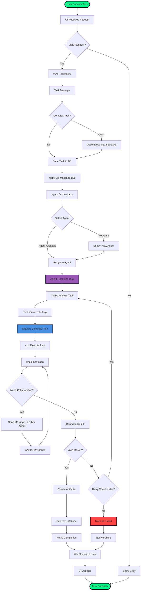

## Agent Collaboration Workflow

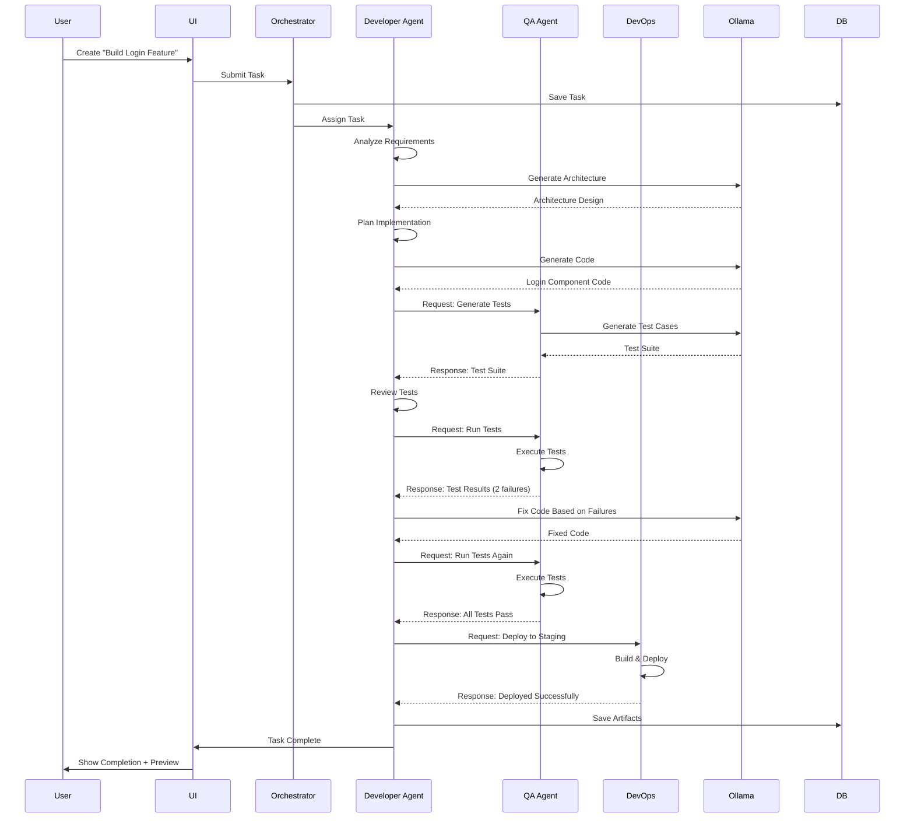

## Real-Time Update Flow

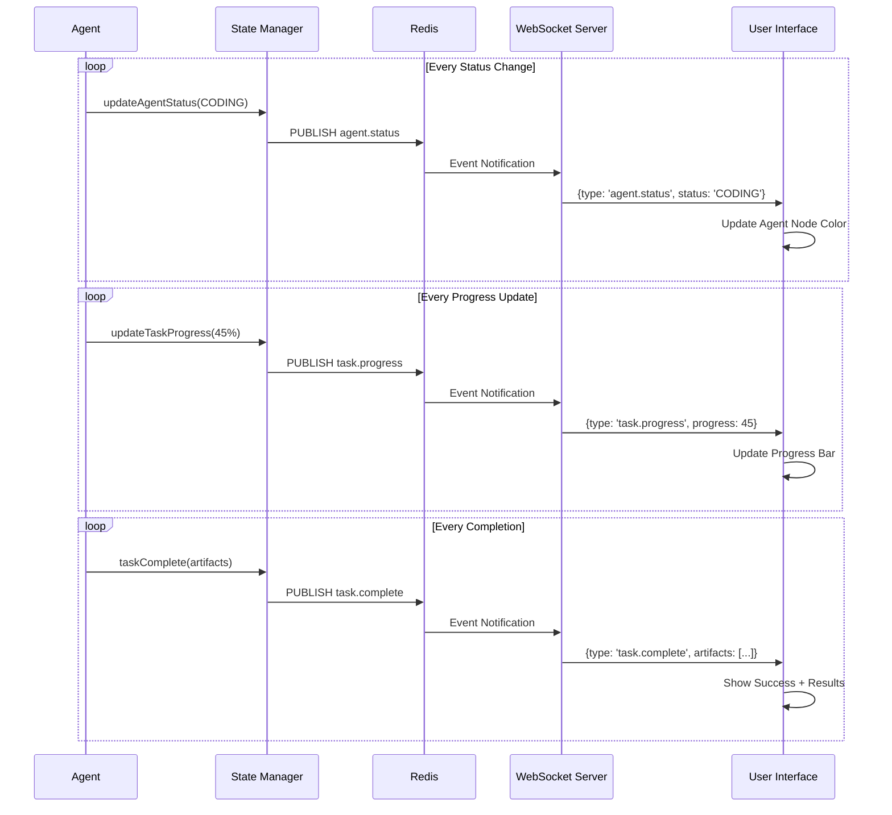

## Ollama Integration Workflow

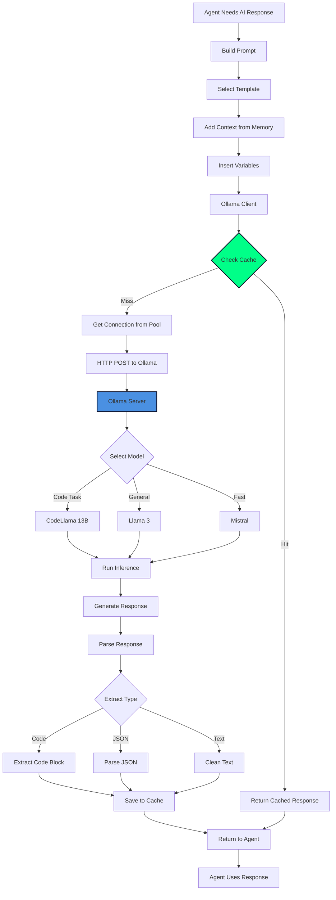

## Task Decomposition Workflow

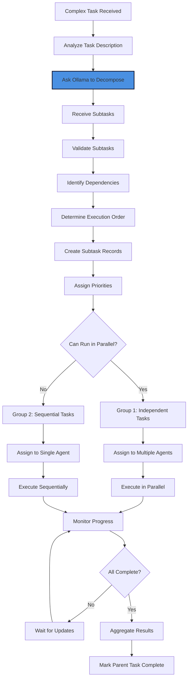

## Agent Lifecycle

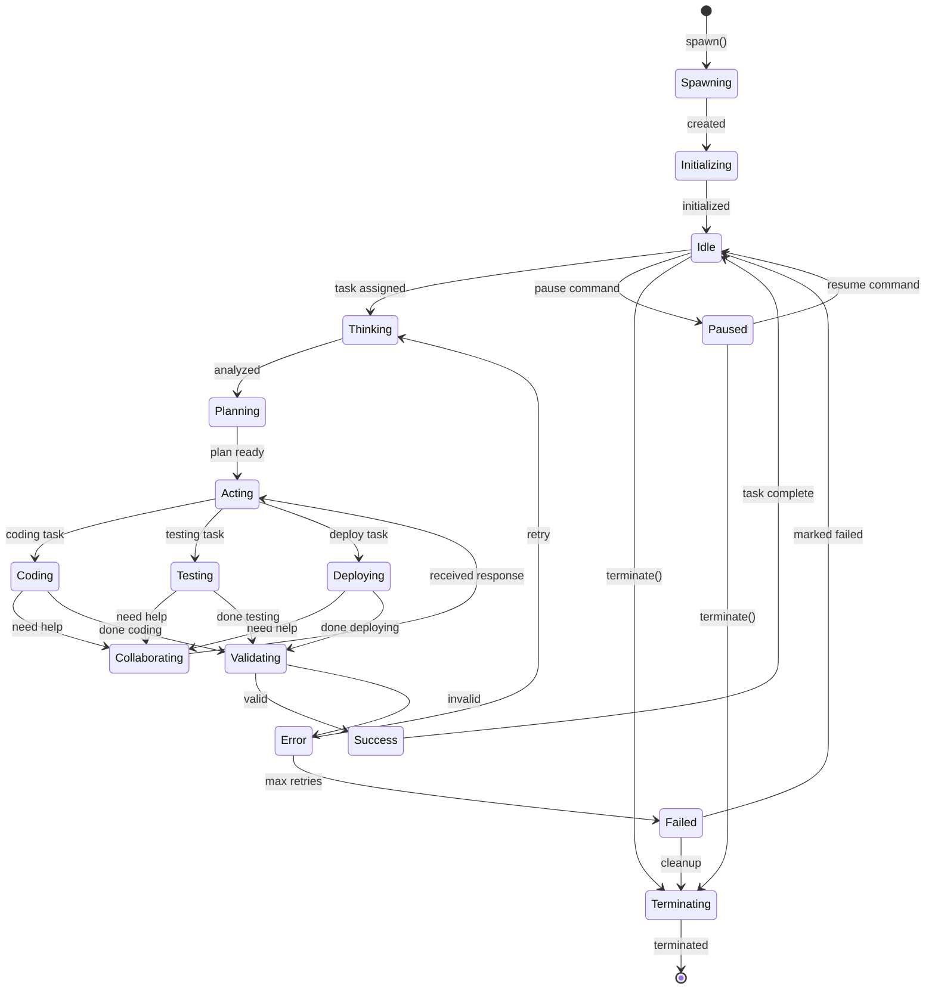

## Message Flow Patterns

### Request-Response Pattern

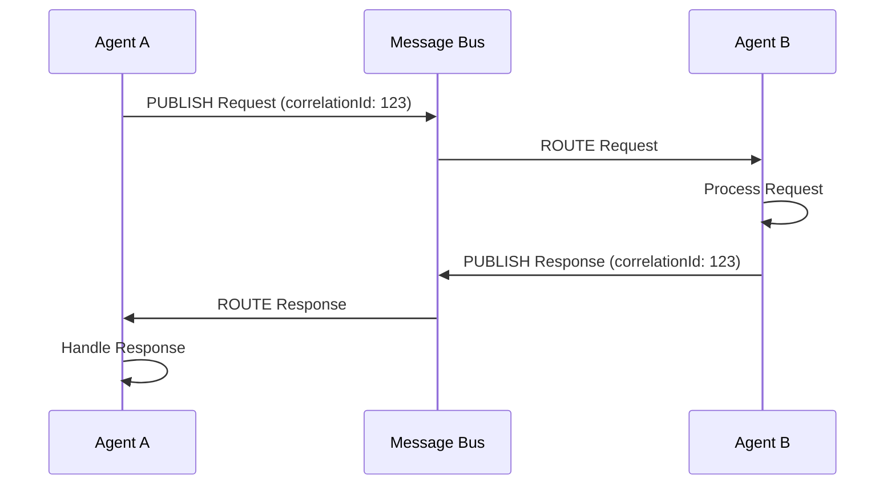

### Broadcast Pattern

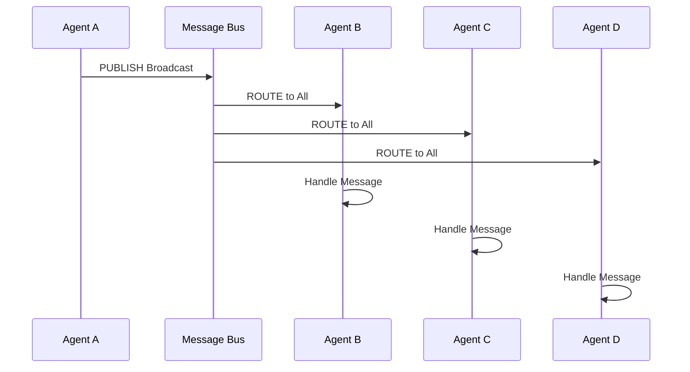

### Event Stream Pattern

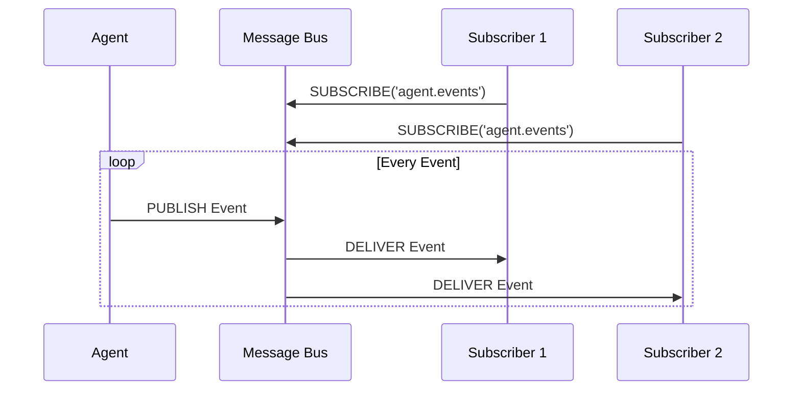

## Error Handling Flow

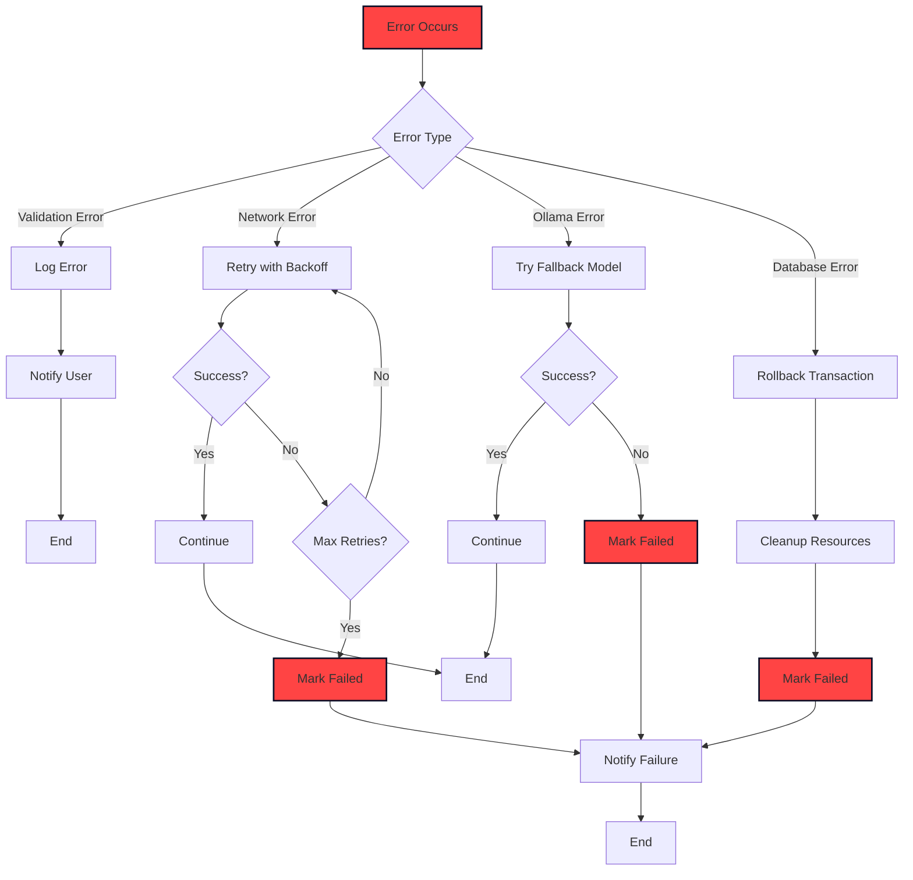

## Deployment Workflow

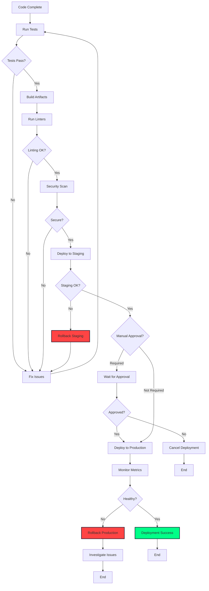

## Data Persistence Flow

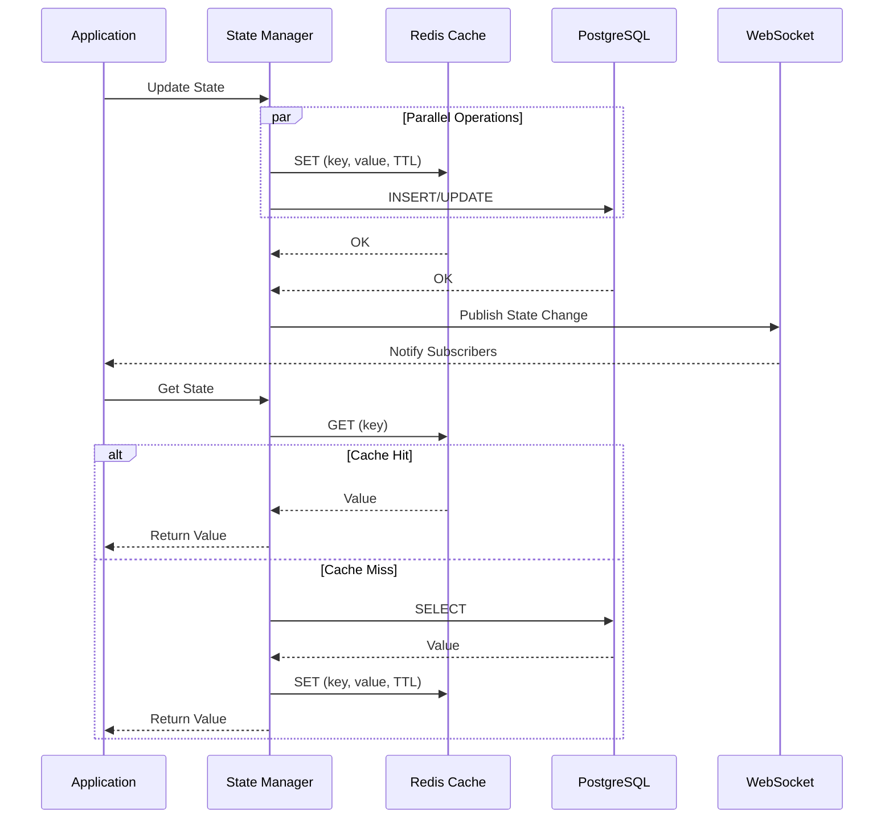

---

These workflows provide a complete view of how the Agent Swamps system operates, from user interaction to AI processing to data persistence and real-time updates.
